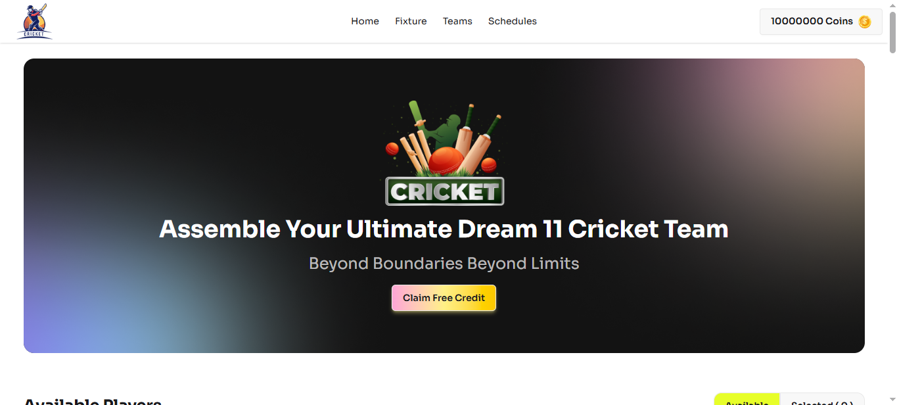
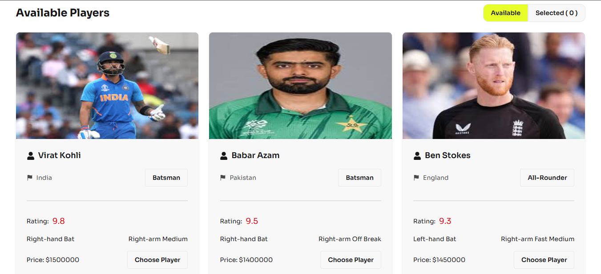
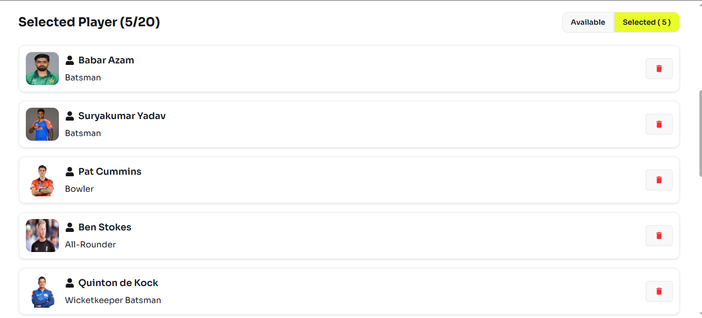

# 🏏 BPL Dream Team


---

## 🌐 Live Links

🔗 **Live Site:** https://dream-bpl-mj.netlify.app/
💻 **Repository:** https://github.com/JayedHoshen/BPL_Dream

---

## 📌 Project Overview

**BPL Dream Team** is a fantasy cricket web application where users can build their own team by selecting players within a limited coin budget.

✨ Built using modern frontend tools with a focus on performance, clean UI, and smooth user experience.

---

## 🚀 Features

✔️ Select players to create your dream team
✔️ Coin-based budget system
✔️ Add & remove players dynamically
✔️ Toast notifications for better UX
✔️ Fully responsive design
✔️ Fast loading with Vite

---

## 🖼️ Preview

### 🏠 Homepage Banner



### 🧑‍🤝‍🧑 Available Players



### ✅ Selected Players



---

## 🛠️ Tech Stack

- ⚛️ React
- ⚡ Vite
- 🎨 Tailwind CSS
- 🌼 DaisyUI
- 🔔 React Toastify
- 💾 LocalStorage

---

## 📂 Folder Structure

```bash
BPL_Dream/
│── public/
│── src/
│   ├── components/
│   ├── assets/
│   ├── App.jsx
│   ├── main.jsx
│── package.json
```

---

## ⚙️ Setup & Installation

```bash
# Clone the repo
git clone https://github.com/JayedHoshen/BPL_Dream.git

# Go to project folder
cd BPL_Dream

# Install dependencies
npm install

# Start development server
npm run dev
```

---

## 🎯 How It Works

1️⃣ Browse available players
2️⃣ Add players within your coin limit
3️⃣ Manage your team
4️⃣ Remove players anytime

---

## 🌟 Future Plans

- 🔐 User Authentication
- 📊 Advanced player stats
- 🌍 Backend integration
- 🏆 Leaderboard system

---

## 🤝 Contributing

Contributions are welcome!
Feel free to fork and submit a pull request 🚀

---

## 👨‍💻 Author

**Jayed Hoshen**
🔗 https://github.com/JayedHoshen

---

## 📄 License

Licensed under the **MIT License**

---

## ⭐ Show Your Support

If you like this project, please give it a ⭐ on GitHub ❤️


